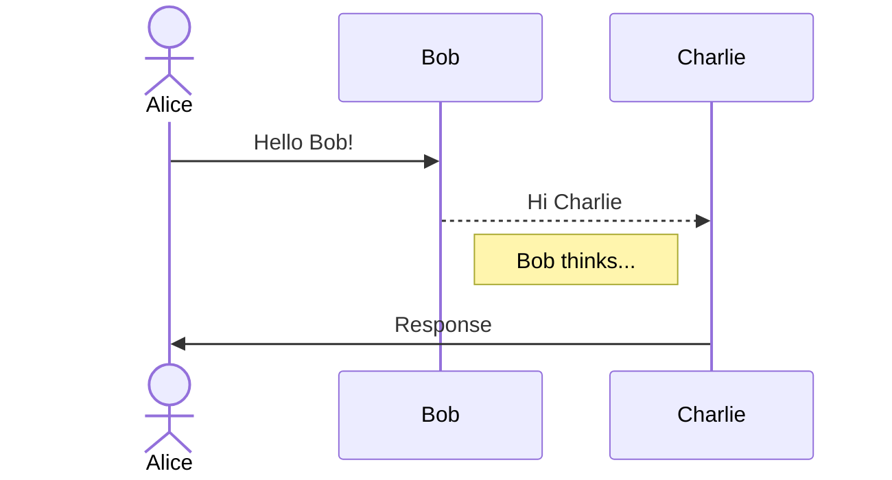

# Sequence Diagram Editor - 2D Canvas

Mermaid形式のシーケンス図をGUIで作成・編集できるブラウザアプリケーション（2D Canvas実装版）

## 機能

- ✅ **2Dビジュアライゼーション**: HTML5 Canvasを使用した2Dシーケンス図の表示
- ✅ **Mermaid完全サポート**: Mermaidシーケンス図構文の読み込み・エクスポート
- ✅ **双方向同期**: GUI ⇔ Mermaidテキスト間での双方向変換
- ✅ **ドラッグ&ドロップ**: パレットからキャンバスへ要素を配置
- ✅ **インタラクティブ編集**: 要素のドラッグ移動、プロパティ編集
- ✅ **直感的な操作**: ライフラインクリックでメッセージ作成
- ✅ **リアルタイムプレビュー**: 変更が即座に2Dビューに反映

## 対応要素

### 基本要素
- **Participant / Actor**: 参加者とアクター
- **Message**: 10種類の矢印タイプ（実線、破線、矢印、X、非同期など）
- **Note**: 左、右、またはover配置のノート
- **Activation**: ライフラインのアクティベーション

### 制御構造
- **loop**: ループ
- **alt / opt**: 条件分岐
- **par**: 並列処理
- **critical**: クリティカルセクション
- **break**: ブレーク
- **rect**: 背景ハイライト

## 使用方法

### 開発サーバーの起動

```bash
pnpm install
pnpm dev
```

アプリケーションは http://localhost:50005/ で起動します。

### ビルド

```bash
pnpm build
```

ビルド成果物は `dist/` ディレクトリに生成されます。

## インターフェース

アプリケーションは4つの主要なパネルで構成されています：

1. **アイコンパレット（左）**: 要素の追加
   - **Participant**: 参加者アイコン（四角形）をクリックして名前を入力
   - **Actor**: アクターアイコン（人型）をクリックして名前を入力
   - クリック後、キャンバスに自動的に配置されます

2. **2Dキャンバス（中央）**: シーケンス図の編集
   - **Participant/Actorの移動**: 要素をドラッグして水平方向に移動
   - **メッセージ作成**: 「Create Message」ボタンをクリック後、送信元のライフライン（縦線）をクリック、次に送信先のライフラインをクリック
   - **要素の選択**: 要素をクリックしてプロパティパネルで編集

3. **プロパティパネル（右上）**: 選択した要素のプロパティ編集
   - **Participant/Actor**: タイプ、ラベルの変更
   - **Message**: 矢印タイプ、テキストの変更
   - **Note**: 位置、テキストの変更
   - 変更後「Apply」ボタンで適用

4. **Mermaidテキストエディタ（右下）**: Mermaid形式のテキスト編集
   - GUI操作が自動的にMermaidテキストに反映されます
   - 「Import Mermaid」ボタンでテキストから図を生成

### ツールバー機能

- **Create Message**: メッセージ作成モードを有効化
- **Export Mermaid**: Mermaidテキストをクリップボードにコピー
- **Import Mermaid**: Mermaidテキストから図を再生成

## 操作方法

### Participant/Actorの追加
1. 左側のパレットから「Participant」または「Actor」をクリック
2. 名前を入力
3. キャンバスに自動的に配置されます

### Participant/Actorの移動
1. キャンバス上の要素をドラッグ
2. 水平方向に自由に移動できます

### メッセージの作成
1. ツールバーの「Create Message」ボタンをクリック
2. 送信元のライフライン（点線の縦線）をクリック
3. 送信先のライフラインをクリック
4. メッセージが作成されます

### プロパティの編集
1. キャンバス上の要素をクリックして選択
2. 右上のプロパティパネルで値を変更
3. 「Apply」ボタンをクリックして適用

## Mermaid構文例



## 技術スタック

- **HTML5 Canvas 2D**: 2Dレンダリング
- **TypeScript**: 型安全な開発
- **Vite**: 高速ビルドツール
- **Custom Parser/Generator**: Mermaidテキストとの双方向変換

## プロジェクト構造

```
src/
├── models/
│   └── types.ts               # データモデル定義
├── editor/
│   └── CanvasEditor.ts        # 2Dキャンバスエディタ
├── ui/
│   ├── IconPalette.ts         # アイコンパレット
│   └── PropertyPanel.ts       # プロパティパネル
├── parser/
│   └── MermaidParser.ts       # Mermaid構文パーサー
├── generator/
│   └── MermaidGenerator.ts    # Mermaidテキスト生成
├── renderer/                  # 旧3Dレンダラー（参考用）
│   ├── SequenceRenderer.ts
│   ├── ParticipantRenderer.ts
│   ├── MessageRenderer.ts
│   ├── NoteRenderer.ts
│   └── ControlRenderer.ts
└── main.ts                    # アプリケーションエントリーポイント
```

## 仕様

詳細な仕様については、`/doc/sequence-spec.md` を参照してください。

## 実装済みの操作性要件

✅ **仕様書準拠の実装**（`doc/sequence-spec.md`の操作性セクション）:
- Participant/Actorのアイコンクリックでキャンバスに配置
- Participant/Actorのドラッグ移動
- ライフラインクリックによるメッセージ作成
- プロパティウィンドウでの要素編集
- 2DベースのGUI操作

## 今後の拡張

- [ ] メッセージの上下ドラッグ機能と順序管理
- [ ] 範囲選択によるalt/opt等の制御構造作成
- [ ] 制御構造のリサイズと範囲内要素の自動管理
- [ ] エクスポート機能（PNG、SVG）
- [ ] アンドゥ/リドゥ機能
- [ ] テーマのカスタマイズ

## ライセンス

MIT
