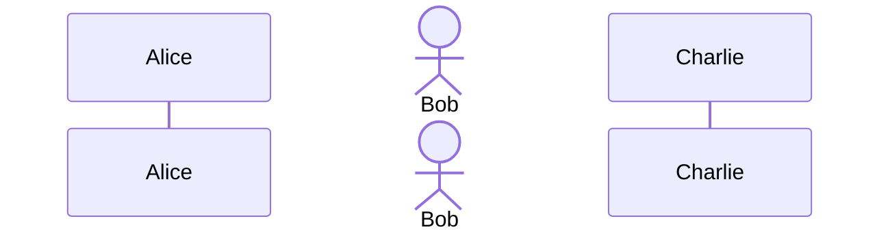
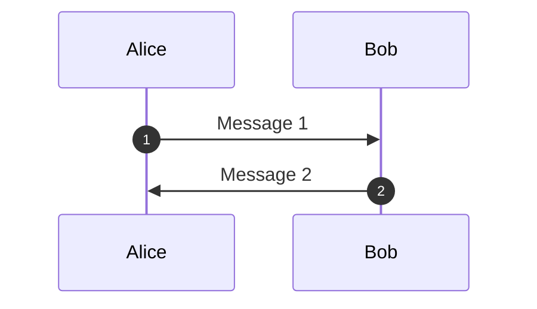

# Sequence Diagram Editor (mxGraph)

A GUI-based sequence diagram editor that supports Mermaid's sequenceDiagram syntax, built with mxGraph.

## Features

- **Bidirectional Sync**: Edit diagrams via GUI or Mermaid text syntax
- **Full Mermaid Support**: Implements Mermaid sequenceDiagram specification
  - Participants and Actors
  - Messages (10 arrow types)
  - Notes
  - Activation/Deactivation
  - Control Structures (loop, alt, opt, par, critical, break, rect)
  - Boxes for grouping participants
  - Actor creation and destruction
  - Links
  - Autonumbering
- **Visual Editing**: Interactive graph-based diagram editing with mxGraph
- **Export**: Save diagrams as Mermaid (.mmd) files

## Getting Started

### Prerequisites

- Node.js 16+
- pnpm

### Installation

```bash
pnpm install
```

### Development

Start the development server on port 50006:

```bash
pnpm dev
```

The application will be available at http://localhost:50006/

### Build

```bash
pnpm build
```

### Preview Production Build

```bash
pnpm preview
```

## Usage

### GUI Operations (2D Visual Editor)

The editor provides full 2D GUI-based editing capabilities:

#### Toolbar (Left Side)
- **Drag and Drop**: Drag participant/actor icons from the toolbar onto the canvas to create them
- **Element Types**:
  - Participant (rectangular box)
  - Actor (person icon)
  - Note (yellow sticky note)
  - Loop, Alt, Opt (control structures)

#### Canvas (Center)
- **Participants/Actors**:
  - Click and drag from toolbar to canvas to place
  - Drag to reposition horizontally
  - Click to select and view properties

- **Messages** (Edges): ✅
  - **Click a lifeline** (vertical dashed line below participant)
  - **Click another lifeline** to create a message arrow
  - **Drag messages up/down** to reorder (vertical movement only)
  - Message order is **automatically tracked** and updated
  - Select a message to edit text and arrow type in Properties panel

- **Control Structures** (alt, opt, loop, etc.):
  - Select elements with mouse
  - Create structure to encompass selection
  - Resize structure to change scope
  - Elements within structure are tracked

#### Properties Panel (Right Side - Properties Tab)
- Select any element to view/edit its properties
- Edit participant ID, label, and type
- Modify message text and arrow style
- Change note content and position
- All changes sync automatically

#### Code Panel (Right Side - Code Tab)
- View and edit Mermaid code directly
- Changes sync bidirectionally with visual diagram
- Real-time validation and preview

### Header Actions

- **Export**: Download the diagram as a .mmd file
- **Clear**: Clear the current diagram

## Supported Mermaid Syntax

### Participants



### Messages

Supported arrow types:
- `->` : Solid line, no arrowhead
- `-->` : Dashed line, no arrowhead
- `->>` : Solid line, arrowhead
- `-->>` : Dashed line, arrowhead
- `-x` : Solid line, × at end
- `--x` : Dashed line, × at end
- `-)` : Solid line, open arrowhead
- `--)` : Dashed line, open arrowhead
- `<<->>` : Solid line, both ends
- `<<-->>` : Dashed line, both ends

### Notes

```mermaid
Note right of Alice: This is a note
Note left of Bob: Another note
Note over Alice,Bob: Note spanning multiple participants
```

### Control Structures

```mermaid
loop Every minute
    Alice->>Bob: Check status
end

alt is sick
    Bob->>Alice: Not available
else is well
    Bob->>Alice: Available
end

opt Extra response
    Bob->>Alice: Thanks!
end
```

### Activation

```mermaid
Alice->>+Bob: Activate Bob
Bob-->>-Alice: Deactivate Bob
```

### Boxes

```mermaid
box Purple Group
    participant Alice
    participant Bob
end
```

### Autonumbering



## Architecture

The application follows a Model-View-Controller architecture:

- **Model**: Data structures representing sequence diagrams (Participant, Message, Note, etc.)
- **Parser**: Converts Mermaid text to internal model
- **Generator**: Converts internal model to Mermaid text
- **Renderer**: Visualizes the model using mxGraph
- **UI**: Manages user interactions and coordinates updates

## Project Structure

```
src/
├── models/          # Data models
│   ├── Participant.ts
│   ├── Message.ts
│   ├── Note.ts
│   ├── ControlStructure.ts
│   ├── Box.ts
│   └── SequenceDiagram.ts
├── parser/          # Mermaid text parser
│   └── MermaidParser.ts
├── generator/       # Mermaid text generator
│   └── MermaidGenerator.ts
├── renderer/        # mxGraph renderer
│   └── MxGraphRenderer.ts
├── ui/             # User interface
│   └── App.ts
├── utils/          # Utilities and types
│   └── types.ts
├── types/          # TypeScript type definitions
│   └── mxgraph.d.ts
├── main.ts         # Application entry point
└── style.css       # Styles
```

## Technical Details

- **Framework**: Vanilla TypeScript
- **Build Tool**: Vite
- **Graph Library**: mxGraph 4.2.2
- **Specification**: Mermaid sequenceDiagram syntax

## Known Limitations

- Control structures are not yet fully rendered in the visual diagram
- Some advanced Mermaid features may not be supported
- mxGraph is deprecated but still functional

## GUI Operation Specifications

Based on `doc/sequence-spec.md`:

1. ✅ **Participant/Actor Icons**: Click toolbar icons and place on canvas
2. ✅ **Drag Positioning**: Participants and actors can be dragged horizontally
3. ✅ **Lifeline Click for Messages**: Click lifelines to create message connections
4. ✅ **Message Vertical Drag**: Messages can be dragged up/down to reorder
5. ✅ **Message Order Tracking**: System tracks message start/end and relative positions
6. ✅ **Properties Window**: Edit element properties through dedicated panel
7. 🚧 **Control Structure Selection**: Select elements and wrap with control structures
8. 🚧 **Control Structure Resizing**: Resize structures and track contained elements
9. ✅ **2D GUI Only**: Fully graphical interface, no command-line needed

## How to Create Messages (Edges)

1. **Add participants** by dragging from the toolbar
2. **Click on the first participant's lifeline** (the vertical dashed line below the participant box)
   - The lifeline will turn blue to indicate it's selected
3. **Click on the second participant's lifeline** to complete the message
   - A message arrow will be created automatically
4. **Select the message** to edit its text and arrow type in the Properties panel
5. **Drag the message up or down** to change its order in the sequence

## Future Enhancements

- [ ] Control structure range selection
- [ ] Control structure resizing with element tracking
- [ ] Support for more Mermaid diagram types
- [ ] Export to PNG/SVG
- [ ] Undo/Redo functionality
- [ ] Theme customization

## License

This project is part of the mermaid-test workspace.

## References

- [Mermaid Sequence Diagram Documentation](https://mermaid.js.org/syntax/sequenceDiagram.html)
- [mxGraph Documentation](https://jgraph.github.io/mxgraph/)
- Specification: `doc/sequence-spec.md`
